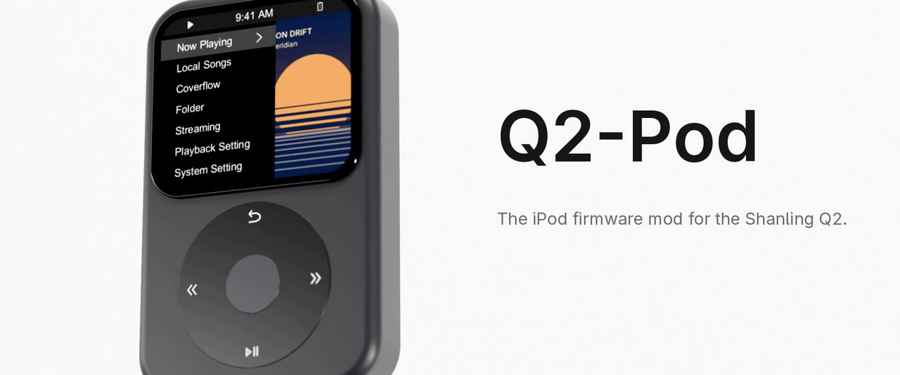

  

  An iPod classic–style firmware mod for the Shanling Q2. 
  Wheel navigation, parametric EQ and Coverflow, built on the stock firmware.

  
  
  
  

  <b><a href="https://github.com/DiamondBond/q2-ringnav/releases/latest">Download</a></b> ·
  <b><a href="docs/changelog.md">Changelog</a></b> ·
  <b><a href="#documentation">Docs</a></b>
   
  <a href="#install">Install</a> |
  <a href="#display-settings">Display</a> |
  <a href="#ipod-ui">iPod UI</a> |
  <a href="#controls">Controls</a> |
  <a href="#parametric-eq">Parametric EQ</a> |
  <a href="#coverflow">Coverflow</a>

## Features

| For listening                                            | Under the hood                                                                    |
| -------------------------------------------------------- | --------------------------------------------------------------------------------- |
| Accent, Home layout and battery style options            | Bluetooth AAC fix: no choppy audio when AirPods and similar headsets auto-connect |
| iPod classic–style lists, Home and Now Playing           | Clock keeps the right time after power-off                                        |
| Wheel navigation with acceleration and position memory   | Less battery drain with the screen off                                            |
| Play next / Add to queue                                 | Faster library browsing                                                           |
| Shuffle Songs across the whole library                   | Long VBR MP3s start at once and seek accurately                                   |
| Parametric EQ: up to 30 bands, per channel, with balance | Long tracks (mixes, audiobooks, podcasts) resume where you left them              |

## Install

> [!IMPORTANT]
> Charge the Q2 first, and leave the microSD card in until the update finishes.

1. [Download](https://github.com/DiamondBond/q2-ringnav/releases/latest) `Q2.Firmware.V*-ipod.zip`, unzip it and copy `update.tar` to the root of the microSD card.
2. On the Q2: **System settings → System Update → TF card update**.
3. **About** shows a version ending in `I`.

**Prefer the stock look?** The Normal build, `Q2.Firmware.V*.zip`, has everything except the [iPod UI](#ipod-ui).

### Restore stock

Flash the [official firmware](https://en.shanling.com/download/150) the same way. If the UI won't start, copy the `recovery-update` folder from [Shanling's recovery package](https://drive.google.com/file/d/1aINQfJu6n0JTQ4hOzzD1uSpSj3TS_NJj/view?usp=drive_link) to the card, then hold previous-song while powering on with the centre button.

## Display settings

**System settings → Display**:

| Setting     | Options                                                   |
| ----------- | --------------------------------------------------------- |
| **Accent**  | Graphite (default), Crimson (stock red), Tidal, Champagne |
| **Home**    | Split (list beside the cover) or Full (list only)         |
| **Battery** | Icon (default), Percent, Icon + Percent                   |

## iPod UI

- **Home:** a list beside the playing track's cover, instead of the carousel.
- **Lists:** flat, four rows per screen, full-width accent selection bar; **`>`** marks rows that open another list.
- **Status bar:** play state and EQ, the time, then Bluetooth, Wi-Fi and battery. The Bluetooth codec (AAC, LDAC…) shows briefly on connect.
- **Now Playing:** "3 of 12", the cover beside title, artist and album, and a slim progress bar with elapsed and remaining time.
- **Quick settings:** pull down from the top edge.
- **Page slides:** pages slide in from the right and back out on Return.
- **Fast-scroll letter:** spinning through a long list shows the current title's first letter.
- **Starts on Home.** **Memory playback → Location** restores your queue paused where you left it; **Track** restarts the song. **In-Vehicle mode** starts playing.

## Controls

| Control                   | What it does                                                                                                                                     |
| ------------------------- | ------------------------------------------------------------------------------------------------------------------------------------------------ |
| **Wheel**                 | One row per tick; keep spinning to speed up. Outside menus it sets volume (iPod: in place of the progress bar on Now Playing, or a small panel). |
| **Centre button**         | Opens the highlighted item. Double-press turns the screen off (single press on Now Playing).                                                     |
| **Hold Play/Pause**       | On a song, album or folder: **Play next** / **Add to queue**.                                                                                    |
| **Hold Return** (iPod)    | Opens Now Playing; the next Return goes back.                                                                                                    |
| **Scrub** (iPod)          | On Now Playing, double-press centre, then turn 5 seconds per tick. Double-press again, press Return, touch, or wait 3 seconds to jump.           |
| **Pull to search** (iPod) | At the top of Local Songs, pull down until "Release to search" appears.                                                                          |

- **List ends:** local lists stop at the end; pause, then turn again to wrap.
- **Position memory:** returning to a recent folder, album, search or menu restores your place until power-off.
- **Artists:** open on Albums, with All Songs one tap away.
- **Pop-ups** (iPod): the wheel moves between OK and Cancel.
- **Key Tone** (iPod): clicks once per row, not per wheel tick.

## Parametric EQ

**Audio settings → Equalizer**:

- **Bands:** Peaking, Low shelf or High shelf; frequency, gain, Q, on/off, and channel (both, **L** or **R**).
- **Balance:** L 12.0 dB to R 12.0 dB in 0.5 dB steps; **R 1.0 dB** plays the left 1 dB quieter.
- **Apply changes:** edits and presets take effect only when chosen.
- **PEQ: ON/OFF:** applies at once and persists; the status-bar **EQ** icon follows it.
- **Preamp:** set automatically to just enough cut that boosts don't clip.

### Import a preset

1. Copy an AutoEQ / Equalizer APO `.txt` to `/EQ/` on the microSD card. `Channel: L`, `R` and `all` sections are supported.
2. **Presets → Import from SD /EQ**, then pick the file.
3. Select the saved preset, then **Apply changes** (and **PEQ: ON**).

## Coverflow

- Run **Update Local Music** first.
- **First open** prepares artwork once; **Cancel** keeps progress for next time. Later opens add only new albums; **Refresh library**, the last card, rebuilds everything.
- **Browse** with the wheel or a swipe; tap a side cover to centre it. Centre or tap the middle cover to open its tracks.
- **Artwork:** `cover.jpg`, `folder.jpg`, then embedded art; otherwise a placeholder.

> [!NOTE]
> Artwork is cached in `.coverflow` on the microSD card, which needs 16 MB free.

## Documentation

| Document                       | Covers                                                |
| ------------------------------ | ----------------------------------------------------- |
| [Changelog](docs/changelog.md) | Every release                                         |
| [iPod UI](docs/ipod.md)        | Layout audit and iPod features                        |
| [Internals](docs/internals.md) | Hooks, selection, position memory, timing and drawing |
| [Building](docs/building.md)   | Building both variants and the MIPS test suite        |
| [Releasing](docs/releasing.md) | Packaging, verifying and publishing                   |
| [Boot logo](docs/boot-logo.md) | Replacing the power-on splash                         |

## Contributing

Found a bug? [Open an issue](https://github.com/DiamondBond/q2-ringnav/issues) with the screen and steps. To build it yourself, see [Building](docs/building.md).

## License

[MIT](LICENSE), covering this repository's code and docs. Shanling's Q2 firmware, from which the release images are built, remains Shanling's property. Not affiliated with Shanling.
